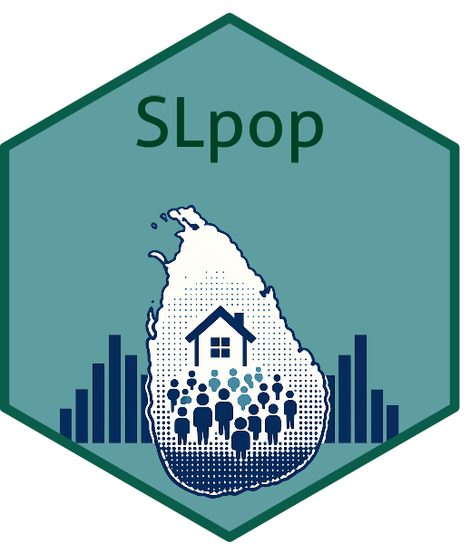

<!-- README.md is generated from README.Rmd. Please edit that file -->

# SLpop

<!-- Add your hex sticker here later -->



<!-- badges: start -->

<!-- badges: end -->

## Overview

**SLpop** is an R data package that provides datasets from the Sri Lanka
Census of Population and Housing 2024 (CPH 2024). The package
facilitates easy access to census data for statistical analysis,
visualization, and research in R.

## Installation

Install the development version from GitHub using **pak**:

``` r
install.packages("pak")
pak::pkg_install("amalirajapaksha/SLpop")
```

Alternatively, using **remotes**:

``` r
install.packages("remotes")
remotes::install_github("amalirajapaksha/SLpop")
```

## Example

Load the package.

``` r
library(SLpop)
```

View all available datasets.

``` r
list_datasets()
#>             Item 
#> "gn_pop_age_sex"
```

Load a dataset.

``` r
data("gn_pop_age_sex")

head(gn_pop_age_sex)
```

Display the structure of the dataset.

``` r
str(gn_pop_age_sex)
#> Classes 'tbl_df', 'tbl' and 'data.frame':    14008 obs. of  16 variables:
#>  $ Province
#> Code     : num  1 1 1 1 1 1 1 1 1 1 ...
#>  $ Province
#> Name     : chr  "Western" "Western" "Western" "Western" ...
#>  $ District
#> Code     : num  11 11 11 11 11 11 11 11 11 11 ...
#>  $ District
#> Name     : chr  "Colombo" "Colombo" "Colombo" "Colombo" ...
#>  $ DS_Division
#> Code  : num  3 3 3 3 3 3 3 3 3 3 ...
#>  $ DS_Division
#> Name  : chr  "Colombo" "Colombo" "Colombo" "Colombo" ...
#>  $ GN_Division
#> Code  : num  5 10 15 20 25 30 35 40 45 50 ...
#>  $ GN_Division
#> Name  : chr  "Sammanthranapura" "Mattakkuliya" "Modara" "Madampitiya" ...
#>  $ GN_Division
#> Number: chr  NA NA NA NA ...
#>  $ 0 - 14               : num  1695 5653 6930 1831 1504 ...
#>  $ 15 - 59              : num  4891 18163 20400 5024 4582 ...
#>  $ 60 - 64              : num  393 1499 1554 353 354 ...
#>  $ 65 and above         : num  661 2820 2844 491 668 ...
#>  $ Male                 : num  3864 13749 15579 3890 3611 ...
#>  $ Female               : num  3776 14386 16149 3809 3497 ...
#>  $ Total                : num  7640 28135 31728 7699 7108 ...
```

Obtain summary statistics.

``` r
summary(gn_pop_age_sex)
```

View the dataset documentation.

``` r
?gn_pop_age_sex
```

## Data Source

The datasets are compiled from the **Sri Lanka Census of Population and
Housing 2024**, published by the Department of Census and Statistics,
Sri Lanka.
