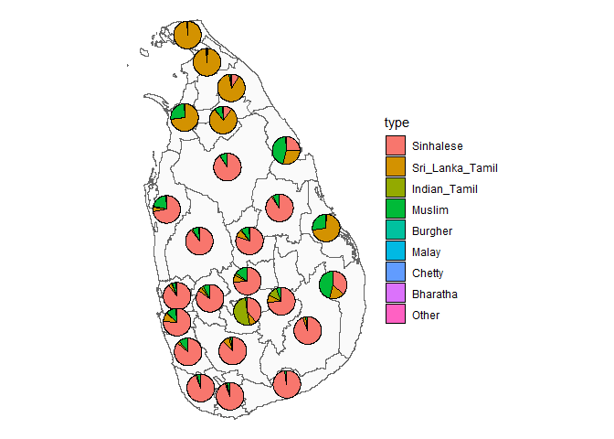

<!-- README.md is generated from README.Rmd. Please edit that file -->

# SLpopData

<!-- Add your hex sticker here later -->


<!-- badges: start -->

<!-- badges: end -->

## Overview

**SLpopData** is an R data package that includes Sri Lanka’s population,
housing, household, and demographic datasets at the District, Divisional
Secretariat (DS), and Grama Niladhari (GN) levels, facilitating
statistical analysis, data visualization, and research in R.

## Installation

Install the development version from GitHub using **pak**:

``` r
install.packages("pak")
pak::pak("amalirajapaksha/SLpopData")
```

Alternatively, using **remotes**:

``` r
install.packages("remotes")
remotes::install_github("amalirajapaksha/SLpopData")
```

## Example

Load the package.

``` r
library(SLpopData)
```

View all available datasets.

``` r
list_datasets()
#>      Item                  
#> [1,] "GNpop_by_EthnicGroup"
#> [2,] "GNpop_by_Religion"   
#>      Title                                                             
#> [1,] "Population by Ethnic Group According to Grama Niladhari Division"
#> [2,] "Population by Religion According to Grama Niladhari Division"
```

Load a dataset.

``` r
data("GNpop_by_EthnicGroup")

head(GNpop_by_EthnicGroup)
```

Display the structure of the dataset.

``` r
str(GNpop_by_EthnicGroup)
#> Classes 'tbl_df', 'tbl' and 'data.frame':    14003 obs. of  17 variables:
#>  $ District_Code                     : chr  "11" "11" "11" "11" ...
#>  $ District_Name                     : chr  "Colombo" "Colombo" "Colombo" "Colombo" ...
#>  $ DSD_Code                          : chr  "3" "3" "3" "3" ...
#>  $ DSD_Name                          : chr  "Colombo" "Colombo" "Colombo" "Colombo" ...
#>  $ GND_Code                          : chr  "5" "10" "15" "20" ...
#>  $ GND_Name                          : chr  "Sammanthranapura" "Mattakkuliya" "Modara" "Madampitiya" ...
#>  $ Total                             : int  7640 28135 31728 7699 7108 13714 11925 7771 6090 9186 ...
#>  $ Sinhalese                         : int  3234 7454 8253 2156 3079 3525 4123 2117 840 1447 ...
#>  $ Sri_Lanka_Tamil                   : int  2485 11566 14043 2171 1728 7103 7010 3934 4873 7144 ...
#>  $ Indian_Tamil_or_Malaiyaga_Thamilar: int  32 596 396 438 29 762 464 317 127 133 ...
#>  $ Sri_Lanka_Moor_or_Muslim          : int  1865 8214 8712 2893 2237 2142 277 1199 211 454 ...
#>  $ Burgher                           : int  16 189 147 NA 17 107 15 66 14 NA ...
#>  $ Malay                             : int  NA 50 132 34 NA 56 28 15 NA NA ...
#>  $ Sri_Lanka_Chetty                  : int  NA 13 NA NA NA NA NA NA NA NA ...
#>  $ Bharatha                          : int  NA NA 25 NA NA NA NA 116 NA NA ...
#>  $ Veddahs                           : int  NA NA NA NA NA NA NA NA NA NA ...
#>  $ Other                             : int  8 53 20 7 18 19 8 7 25 8 ...
```

Obtain summary statistics.

``` r
summary(GNpop_by_EthnicGroup)
```

View the dataset documentation.

``` r
?GNpop_by_EthnicGroup
```

``` r
library(dplyr)
#> 
#> Attaching package: 'dplyr'
#> The following objects are masked from 'package:stats':
#> 
#>     filter, lag
#> The following objects are masked from 'package:base':
#> 
#>     intersect, setdiff, setequal, union
library(sf)
#> Linking to GEOS 3.14.1, GDAL 3.12.1, PROJ 9.7.1; sf_use_s2() is TRUE
library(ceylon)
#> 
#> Attaching package: 'ceylon'
#> The following object is masked from 'package:datasets':
#> 
#>     rivers
library(tidyr)
library(ggplot2)
library(scatterpie)
#> Warning: package 'scatterpie' was built under R version 4.6.1
#> scatterpie v0.2.6 Learn more at https://yulab-smu.top/

district_ethnic <- GNpop_by_EthnicGroup |>
  group_by(District_Name) |>
  summarise(
    Sinhalese = sum(Sinhalese, na.rm = TRUE),
    Sri_Lanka_Tamil = sum(Sri_Lanka_Tamil, na.rm = TRUE),
    Indian_Tamil = sum(Indian_Tamil_or_Malaiyaga_Thamilar, na.rm = TRUE),
    Muslim = sum(Sri_Lanka_Moor_or_Muslim, na.rm = TRUE),
    Burgher = sum(Burgher, na.rm = TRUE),
    Malay = sum(Malay, na.rm = TRUE),
    Chetty = sum(Sri_Lanka_Chetty, na.rm = TRUE),
    Bharatha = sum(Bharatha, na.rm = TRUE),
    Veddahs = sum(Veddahs, na.rm = TRUE),
    Other = sum(Other, na.rm = TRUE),
    .groups = "drop"
  ) |>
  mutate(
    DISTRICT = toupper(District_Name),
    DISTRICT = recode(DISTRICT,
                      "MONERAGALA" = "MONARAGALA")
  )


districts <- ceylon::district |>
  filter(DISTRICT != "[UNKNOWN]") |>
  left_join(district_ethnic, by = "DISTRICT")


centroids <- st_centroid(districts)
#> Warning: st_centroid assumes attributes are constant over geometries
xy <- st_coordinates(centroids)
centroids$x <- xy[,1]
centroids$y <- xy[,2]


centroids_df <- centroids |>
  st_drop_geometry()


ggplot() +
  geom_sf(
    data = districts,
    fill = "grey98",
    colour = "grey40",
    linewidth = 0.3
  ) +
  geom_scatterpie(
    data = centroids_df,
    aes(x = x, y = y, r = 15000),   # adjust radius as needed
    cols = c(
      "Sinhalese",
      "Sri_Lanka_Tamil",
      "Indian_Tamil",
      "Muslim",
      "Burgher",
      "Malay",
      "Chetty",
      "Bharatha",
      "Veddahs",
      "Other"
    )
  ) +
  coord_sf() +
  theme_void()
```



## Data Source

The datasets are compiled from the **Sri Lanka Census of Population and
Housing 2024**, published by the Department of Census and Statistics,
Sri Lanka.
